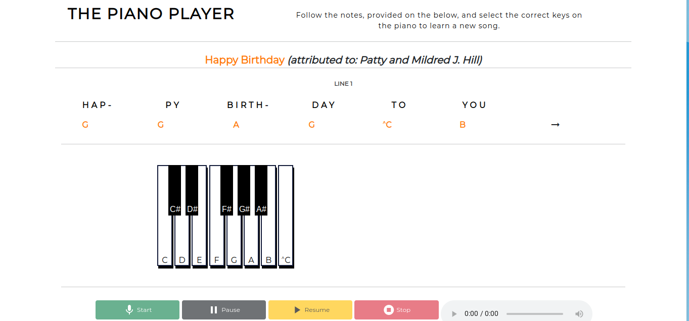

# Piano Keys

You’re a web developer who has been hired by a music education company. This client wants you to create an interactive game to help their beginner-level piano students study. Create a piano player with DOM events in JavaScript!

## Version 1

- A webpage that presents the user a basic C Major piano octave. 
- The user can click on the each individual key and hear the corresponding sound/tone.
- Lyrics and notes are displayed, allowing the user to learn how to play the "Happy Birthday" song.
- The user has the option of granting the webpage microphone permission. With granted permission, the user can record themselves playing "Happy "Birthday". 
  - The user can listen to their recording via the webpage or download their recording in order to listen to it locally.  

### Intent for Version 2

- Convert from relatively static to more dynamic
  - Provide the user with the option to click on the piano keys or use their keyboard to select appropriate notes. 
- Modify the appearance of the audio controls

### Intent for Version 3

- Create a system that guides the uer through the song. The system would:
  - Indiciate which note should be clicked, when, and how long the note should be held.
  - Record correctly or incorrectly selected notes
